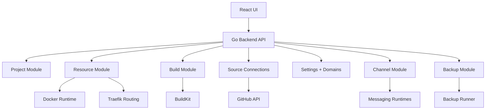
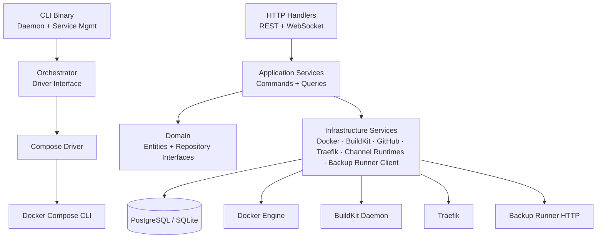

# Architecture

## System Overview



## Layer Architecture



## Backend Conventions

The backend follows a pragmatic DDD/CQRS split:

- `internal/domain/`
  Entities, domain errors, list options/results, repository interfaces
- `internal/application/command/`
  Write use cases: create, update, delete, start, stop
- `internal/application/query/`
  Read use cases: get by id, list
- `internal/application/services/`
  Application-facing service contracts for orchestration and runtime features
- `internal/infrastructure/persistence/models/`
  GORM persistence records used by `AutoMigrate()`
- `internal/infrastructure/persistence/repositories/`
  Repository implementations and DB error mapping
- `internal/infrastructure/services/`
  Service implementations: Docker runtime, BuildKit, GitHub integration, channel runtimes
- `internal/handler/rest/`
  HTTP handlers, request DTOs, response DTOs, error mapping
- `cmd/api/main.go`
  Composition root: instantiate repositories/services/handlers and register routes

## Orchestrator Layer

The CLI uses a pluggable `Driver` interface in `internal/orchestrator/` that abstracts the orchestration backend. This is separate from `internal/infrastructure/docker/`, which is the raw Docker Engine client used by the API.

```text
internal/orchestrator/
├── driver.go              ← Driver interface + ServiceStatus types
├── config.go              ← DaemonConfig, file paths, load/save
├── compose/
│   └── driver.go          ← Docker Compose driver (shells out to `docker compose`)
└── daemon/
    ├── daemon.go          ← Health check loop, retry logic
    ├── status.go          ← Status file read/write
    └── install.go         ← launchd/systemd service generators
```

Currently only the Compose driver is implemented. Future drivers (k3s, swarm, nomad) implement the same `Driver` interface without changing CLI commands. See [CLI docs](cli.md) for details.

## Go Package Structure

```text
internal/
├── domain/
│   ├── project.go
│   ├── environment.go
│   ├── resource.go
│   ├── resource_port.go
│   ├── resource_env_var.go
│   ├── resource_run.go
│   ├── database_source.go
│   ├── storage.go
│   ├── backup_config.go
│   ├── backup.go
│   ├── restore.go
│   ├── build_job.go
│   ├── source_connection.go
│   ├── source_provider.go
│   └── channel.go
├── application/
│   ├── command/        ← write use cases
│   ├── query/          ← read use cases
│   └── services/       ← service contracts
├── runner/
│   ├── http/           ← internal runner HTTP endpoints
│   ├── model/          ← runner request / response types
│   ├── service/        ← CLI execution services
│   └── tools/          ← runner-side tool resolution
├── infrastructure/
│   ├── persistence/
│   │   ├── models/     ← GORM records
│   │   └── repositories/
│   └── services/
│       ├── build_service.go        ← BuildKit + git clone
│       ├── docker_service.go       ← Docker Engine runtime
│       ├── github_service.go       ← GitHub API integration
│       ├── backup_runner_client.go ← API -> backup-runner bridge
│       └── channel_runtimes/       ← Discord, Telegram, Slack, WhatsApp
└── handler/
    ├── rest/           ← HTTP handlers
    └── ws/             ← WebSocket handlers (logs, terminal)
```

## Tech Stack

| Concern           | Library / Tool                         |
| ----------------- | -------------------------------------- |
| HTTP router       | `gin-gonic/gin`                        |
| ORM               | `gorm.io/gorm`                         |
| Database          | PostgreSQL (prod) / SQLite (local)     |
| Container runtime | Docker Engine API (`docker/docker`)    |
| Image builds      | BuildKit (`moby/buildkit`)             |
| WebSocket         | `gorilla/websocket`                    |
| Auth              | JWT (`golang-jwt/jwt`) + bcrypt        |
| Encryption        | AES-256 for secrets at rest            |
| DB backup runner  | Internal HTTP service + DB CLI tools   |
| Frontend          | Vite + React + TanStack Router         |
| Styling           | Tailwind CSS v4                        |

## Adding a new backend module

When adding a new DB-backed module, follow this order:

1. Add the domain entity and domain errors in `internal/domain/`
2. Add the repository interface in `internal/domain/`
3. Add the GORM record in `internal/infrastructure/persistence/models/`
4. Register the new record in `internal/infrastructure/persistence/models/models.go`
5. Implement the repository in `internal/infrastructure/persistence/repositories/`
6. Add write use cases in `internal/application/command/` and read use cases in `internal/application/query/`
7. If the feature needs provider-specific or runtime logic, add an application service contract in `internal/application/services/` and the implementation in `internal/infrastructure/services/`
8. Add the REST handler in `internal/handler/rest/`
9. Wire everything in `cmd/api/main.go`
10. Add Swagger annotations and regenerate `docs/`
11. Run `go test ./...`

## Rules of thumb

- Put validation and invariants on the write path in domain constructors or command handlers
- Do not return raw domain entities from REST handlers; map them to transport DTOs
- Reuse `internal/contract/common.BaseRequestModel` and `BaseResponseModel` for paginated list endpoints
- Use one canonical domain error per business case, then map it to one public API error code
- Keep DB unique constraints as the final line of defense and map duplicate-key errors back to the same domain error
- Use `FindBy...` for nullable lookups and `GetBy...` for required lookups
- Add Swagger comments for every public REST endpoint and regenerate docs after changing the API

## Design Notes

**Encrypted secrets:** environment variables marked `is_secret=true` and all channel/source credentials are AES-encrypted before DB storage. The encryption key (`LLM_CONFIG_ENCRYPTION_KEY`) must be exactly 32 characters.

**Docker isolation:** each resource maps to a single Docker container. Port conflicts are validated before start — no two resources in the same environment may expose the same host port.

**BuildKit requirement:** the build pipeline requires a running BuildKit daemon. Without `BUILDKIT_HOST`, git-based builds will fail. The Docker-in-Docker setup in `docker-compose.yml` provisions this automatically.

**Backup runner requirement:** MySQL, MariaDB, PostgreSQL, and MongoDB backup and restore require a reachable `backup-runner` service. In local development, the API can call `http://127.0.0.1:8081`; in compose/VPS deployments, it should use `http://backup-runner:8081`.

**Bundled DB tools:** the backup runner image carries the CLI tools needed for MySQL, MariaDB, PostgreSQL, and MongoDB execution. The main API process does not assume local access to `mysqldump`, `mariadb-dump`, `pg_dump`, `mongodump`, or their restore counterparts.

**WebSocket streams:** build logs and resource run logs are streamed over persistent WebSocket connections. The browser reconnects automatically on disconnect.

**Schema changes:** simple additions (new nullable columns) can rely on `AutoMigrate()`. Destructive changes (renames, drops, type changes) require manual migration scripts.
