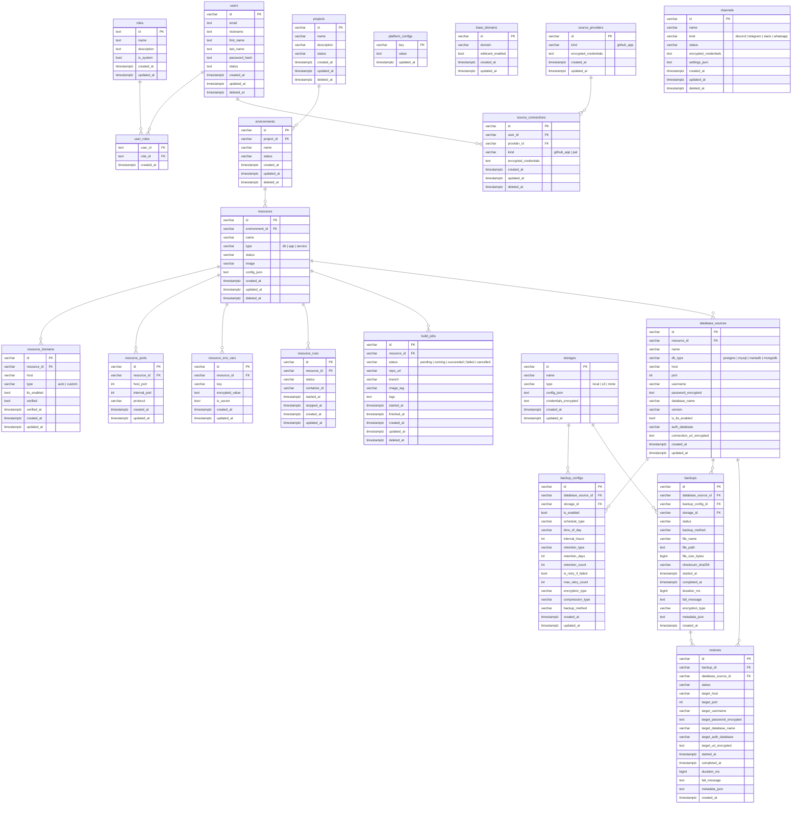

# Database

The app uses GORM with `AutoMigrate()` on boot.

Select the runtime DB with `DB_DRIVER=postgres|sqlite`.

## Tables managed by GORM

- `users`
- `roles`
- `user_roles`
- `projects`
- `environments`
- `resources`
- `resource_ports`
- `resource_env_vars`
- `resource_runs`
- `build_jobs`
- `database_sources`
- `storages`
- `backup_configs`
- `backups`
- `restores`
- `channels`
- `source_providers`
- `source_connections`

## Entity Relationship Diagram

## Notes

- Simple schema changes (new fields) can rely on `AutoMigrate()`.
- For breaking schema changes or data migrations, write a dedicated migration script.
- When adding a new schema, register the GORM record in `internal/infrastructure/persistence/models/models.go`.
