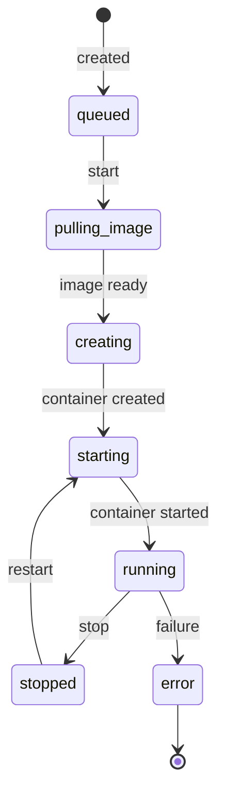
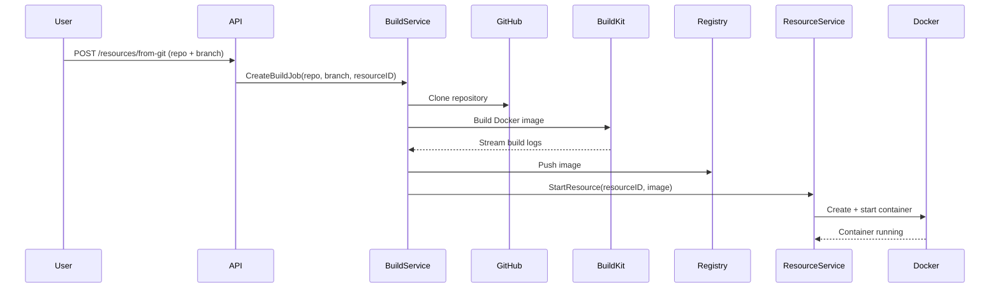
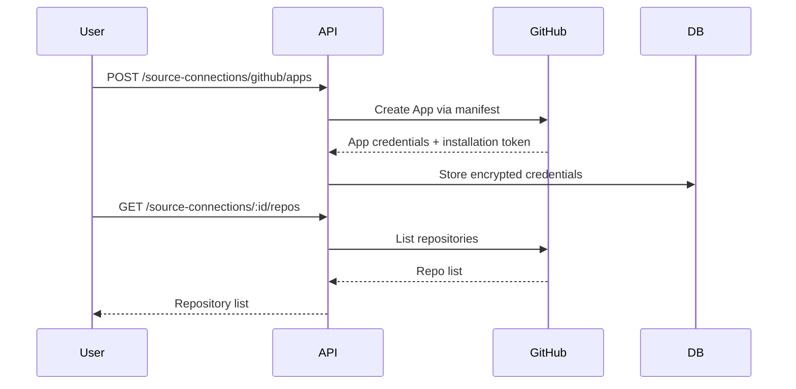
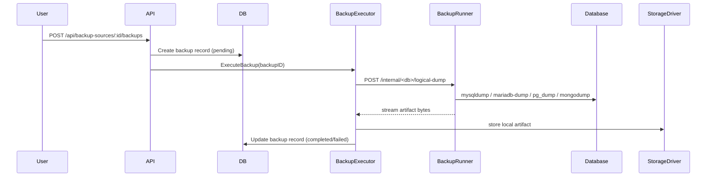
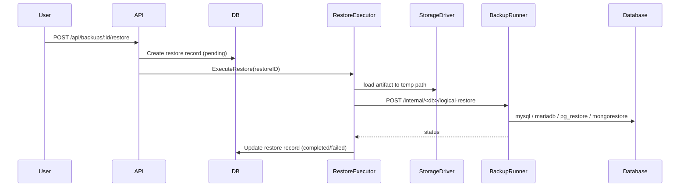
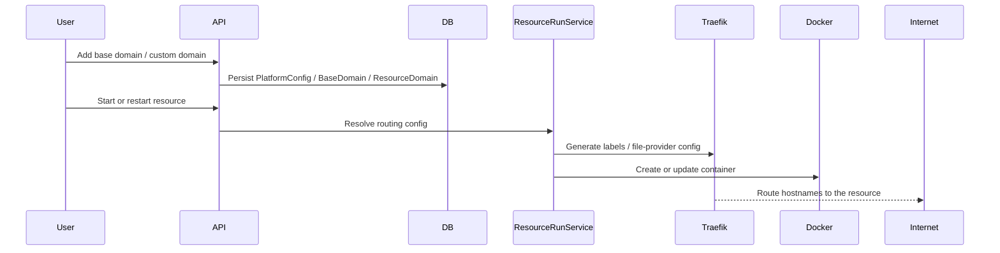

# Domain Model

## Hierarchy

```
Project
└── Environment (fork-able)
    └── Resource (db | app | service)
        ├── ResourcePort
        ├── ResourceEnvVar
        ├── ResourceDomain
        └── ResourceRun

PlatformConfig
└── BaseDomain

DatabaseSource
├── BackupConfig
├── Backup
└── Restore

Storage
└── BackupConfig
```

## Resource Types

| Type      | Description                                                   |
| --------- | ------------------------------------------------------------- |
| `db`      | Database containers (Postgres, MySQL, MariaDB, Redis, MongoDB, etc.) |
| `app`     | Application containers; can be built from a git repository    |
| `service` | Supporting service containers                                 |

## Resource Lifecycle



## Build Pipeline

Resources of type `app` can be built from source:



### Build Job Lifecycle

```
pending → running → succeeded
                 → failed
                 → cancelled
```

Real-time build logs are streamed to the browser via WebSocket at `/api/ws/builds/:id`.

## Source Connections

Source connections store credentials for accessing private git repositories.

| Type         | Description                                      |
| ------------ | ------------------------------------------------ |
| `github_app` | GitHub OAuth App (manifest flow, broader scope)  |
| `pat`        | Personal Access Token (simpler, user-scoped)     |

Credentials (tokens, keys) are AES-encrypted before being stored in the database.



## Database Backup & Restore

Database backup/restore is split into two responsibilities:

1. **`cmd/api`** — stores backup sources, storages, backup configs, backups, restores; exposes REST endpoints and UI; orchestrates backup and restore jobs

2. **`cmd/backup-runner`** — stateless internal service; runs database CLI tools; detects MySQL/MariaDB/PostgreSQL versions when needed; streams dump/restore data back to the API

### Supported databases

- MySQL logical dump / restore via `mysqldump` / `mysql`
- MariaDB logical dump / restore via `mariadb-dump` / `mariadb`
- PostgreSQL logical dump / restore via `pg_dump -Fc` / `pg_restore`
- MongoDB logical dump / restore via `mongodump --archive` / `mongorestore --archive`
- Local storage backend (`none` or `gzip` compression)

The API persists metadata and artifact references. The runner does not keep its own database.

### Backup Execution Flow



### Restore Execution Flow



## Domain Routing

Resources can expose HTTP services through managed domains:

| Type     | Description |
| -------- | ----------- |
| `auto`   | Generated from a managed base domain, optionally using wildcard DNS |
| `custom` | User-supplied hostname that must be DNS-verified before secure routing |

Platform settings control: public IP, app domain, app TLS, Traefik Docker network, certificate resolver, managed base domains.



## Channel Integrations

Channels connect external messaging platforms to the platform:

| Kind       | Description                             |
| ---------- | --------------------------------------- |
| `discord`  | Discord bot integration                 |
| `telegram` | Telegram bot integration                |
| `slack`    | Slack workspace integration             |
| `whatsapp` | WhatsApp (QR code provisioning)         |

Channel credentials are encrypted at rest. Each channel runs an independent runtime goroutine started/stopped via the channel service.
