# Tango Go Backend — Architecture & Implementation Plan

> This document captures the target system design, module breakdown, and implementation roadmap for the Tango Go backend, with a focus on the agent orchestration layer.

> Note: this file describes the target architecture. The pragmatic phase-one cut is documented separately in `roadmap/MVP_SCOPE.md`.

---

## Scope Note

For the practical MVP scope, see `roadmap/MVP_SCOPE.md`.

This architecture document should be read as the longer-term direction, not as a statement that every subsystem below is already implemented in the current product.

The current Phase 1 foundation is workspace-centric and uses `llm_providers` plus `agent_providers` for agent-level primary and fallback routing.

For multi-agent execution, Tango should keep two separate structures:

- `agents.parent_agent_id` and `agents.kind` for supervisor tree orchestration
- `workflows`, `workflow_nodes`, and `workflow_edges` for DAG-style sequential and parallel execution

Execution history should be persisted through `runs` and `run_steps`, not mixed into conversation messages.

---

## System Overview

Tango is a platform for orchestrating AI agents to help run an autonomous company. The Go backend is responsible for **agent orchestration**. It does not replace the UI or the external agent runtimes.

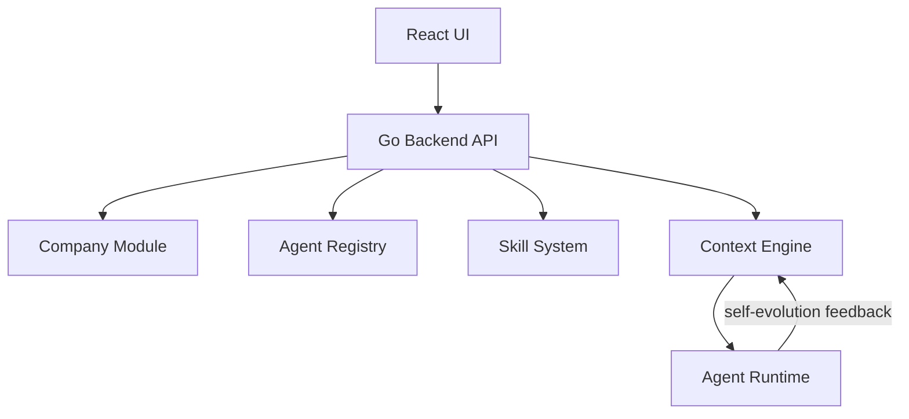

---

## Multi-Agent Execution Model

Tango should support both supervisor-style delegation and DAG-style workflow execution.

### Supervisor Tree

- `workspace` contains many `agents`
- `agents.kind` distinguishes `orchestrator` from `worker`
- `agents.parent_agent_id` forms a direct-child hierarchy
- the runtime appends child-agent context into the active agent system prompt
- this model is appropriate for dynamic delegation such as:
  - `CEO -> BA -> Tech Lead -> FE Dev`
  - `CEO -> Writer -> Reviewer`

### Workflow DAG

- fixed execution graphs should be modeled explicitly, not inferred from `parent_agent_id`
- `workflow_nodes` reference `agents`
- `workflow_edges` describe dependencies and execution relationships
- this model is appropriate for deterministic flows such as:
  - `Research -> Image -> Post -> Publish`
  - `Research -> (Image || Post) -> Publish`

### Why Both Exist

- hierarchy answers who may delegate to whom
- workflow graph answers what depends on what
- a single `parent_agent_id` field is not enough to model joins, fan-out, fan-in, or explicit parallel branches

### Channel Routing

A channel declares its orchestration target via one of two nullable fields:

| Field | Target type | Runtime |
|---|---|---|
| `channels.workspace_id` | `TeamTarget` | Multi-agent workspace orchestration |
| `channels.target_agent_id` | `AgentTarget` | Direct single-agent, no orchestration layer |

Exactly one should be set; `target_agent_id` takes priority if both are present.

When a conversation is created from a channel, it copies the target from the channel at that point in time (`conversation.workspace_id` / `conversation.target_agent_id`). This means the conversation is self-contained — it does not re-read the channel on every message.

`conversationOrchestrationTarget()` inspects the conversation and returns either an `AgentTarget` or a `TeamTarget`, which the `OrchestrationService` then dispatches to `resolveAgentTarget` or `resolveTeamTarget` accordingly.

### Execution History

- `conversations` and `conversation_messages` remain user-facing history and LLM context
- `runs` and `run_steps` capture orchestration and workflow execution traces
- `run_steps` should store decision, call, result, final, and error events for debugging and future Kanban views

### Planned Runtime Services

- `OrchestrationService`
  - entry agent resolution
  - supervisor loop execution
  - dynamic child delegation
- `WorkflowService`
  - workflow, node, and edge CRUD
  - graph validation
  - graph data for UI rendering
- `WorkflowExecutionService`
  - load workflow definitions from DB
  - run sequential and parallel execution
  - future Eino integration point
- `RunTraceService`
  - persist `runs` and `run_steps`
  - expose execution traces to debug and operational UI

### Target Schema Additions

The ERD below mirrors the canonical schema diagram in [erd.mmd](/Users/felix/projects/tango/web/docs/erd.mmd). Update `web/docs/erd.mmd` first when the schema changes, then sync this section.

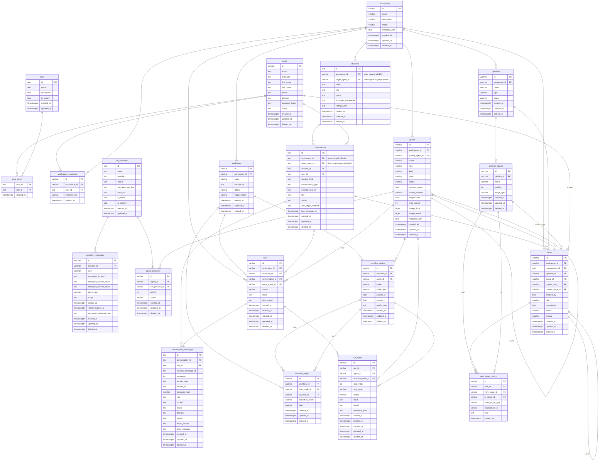

---

## Module Architecture

### Five Main Layers

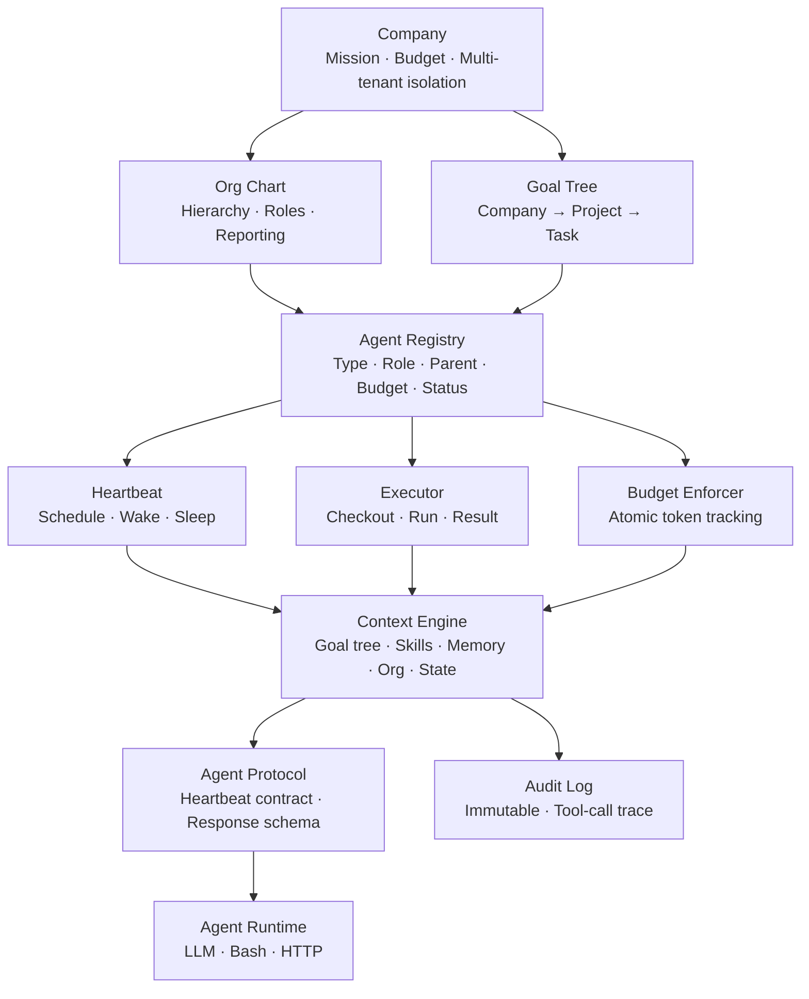

---

## Module Details

### 1. Company

This is the root of the system. Every entity belongs to a single company.

| Field | Description |
|---|---|
| `id` | UUID |
| `name` | Company name |
| `mission` | Top-level mission |
| `budget_total` | Total budget |
| `budget_used` | Consumed budget |
| `owner_id` | Owning user |

**Important:** Cross-company isolation must be enforced at the database query level. Every relevant query should filter by `company_id`.

---

### 2. Org Chart + Goal Tree

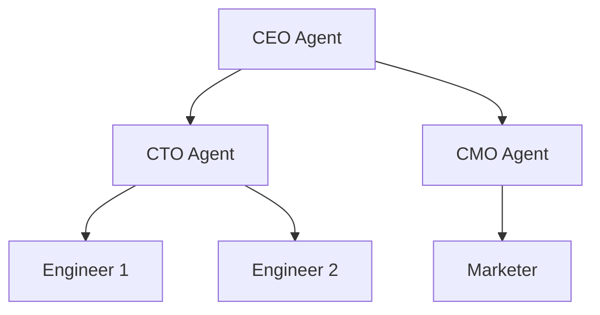

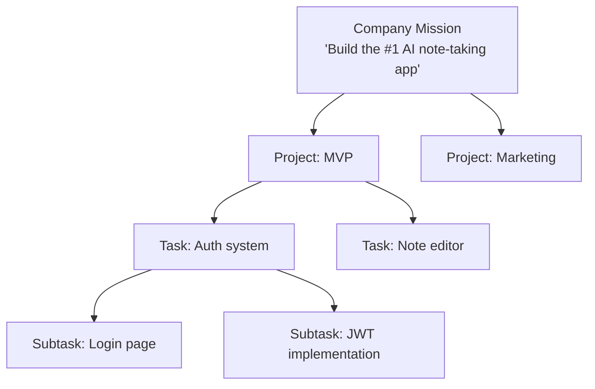

The **Goal Tree** ensures that an agent always knows the reason behind the work. Each task carries its full ancestry from mission to execution.

---

### 3. Agent Registry

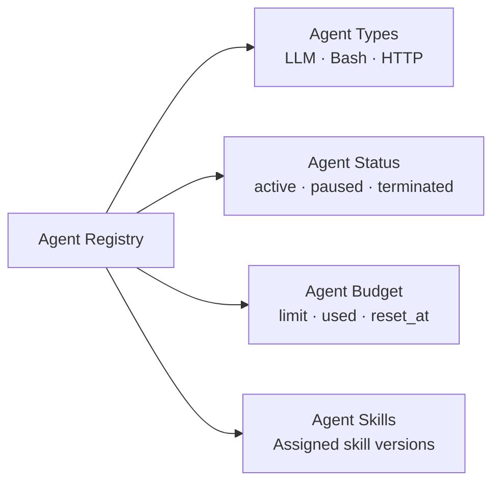

| Field | Description |
|---|---|
| `id` | UUID |
| `company_id` | Owning company |
| `name` | Agent name |
| `role` | CEO / CTO / Engineer... |
| `type` | llm / bash / http |
| `parent_id` | Reporting manager agent |
| `budget_limit` | Monthly token budget |
| `budget_used` | Consumed budget |
| `status` | active / paused / terminated |
| `skills` | Assigned skill version IDs |

---

### 4. Heartbeat + Executor + Budget Enforcer

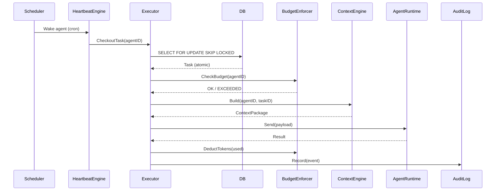

**Atomic checkout:** use `SELECT ... FOR UPDATE SKIP LOCKED` so two agents cannot claim the same task.

---

### 5. Skill System

#### Three Pillars

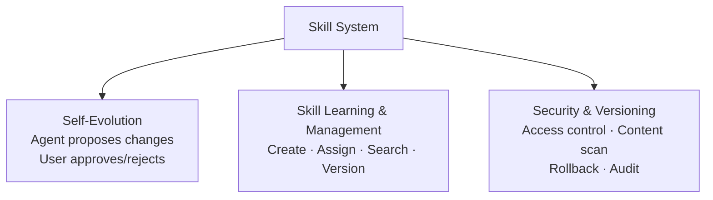

#### Skill Struct

| Field | Description |
|---|---|
| `id` | UUID |
| `owner_id` | Creating user |
| `company_id` | Null for private/public scope |
| `name` | Skill name |
| `content` | SKILL.md content |
| `tags` | Used to match tasks |
| `compatible_agent_types` | llm / bash / http... |
| `visibility` | private / company / public |
| `version` | Current version number |
| `content_hash` | SHA256 for tamper resistance |
| `status` | draft / pending_review / approved / revoked |

#### Visibility Flow

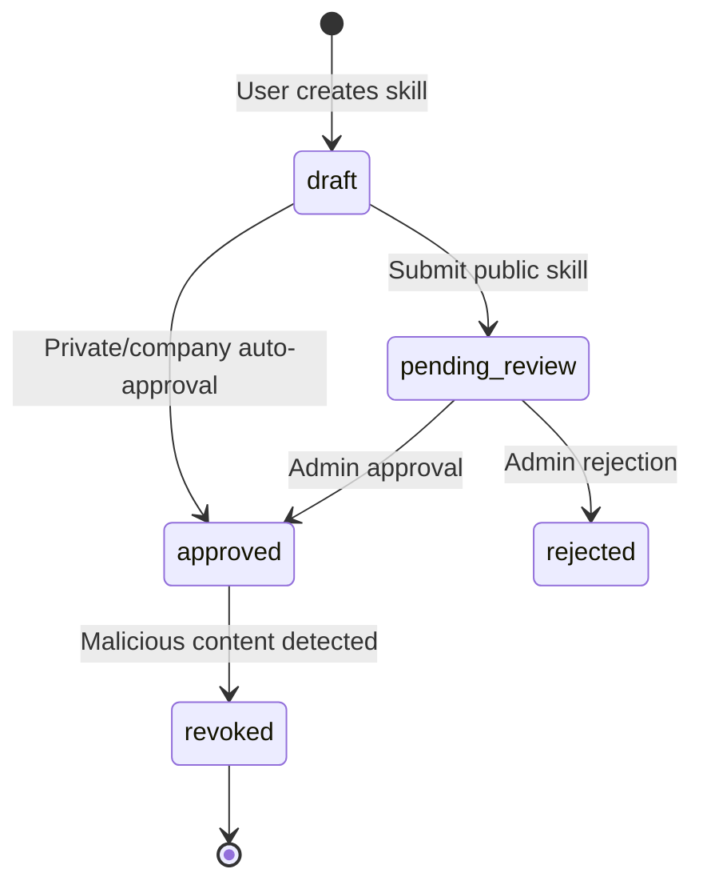

#### Self-Evolution Flow

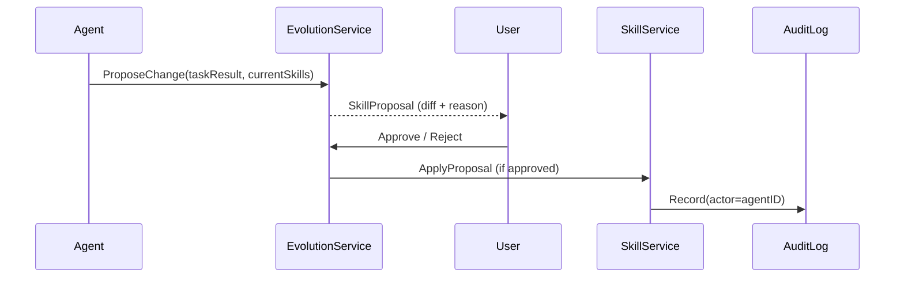

An agent **cannot apply its own changes**. Every change must pass through an approval gate.

#### Security Layers

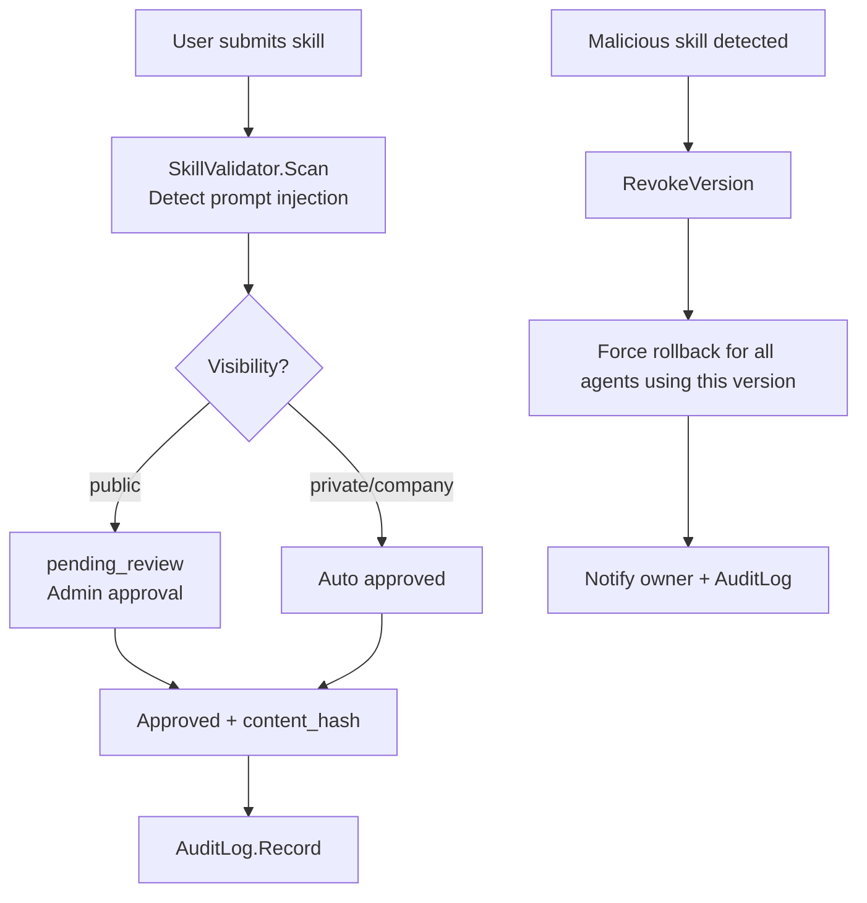

---

### 6. Context Engine

**Context engineering** does more than send a task. It builds the full working environment for the agent before execution.

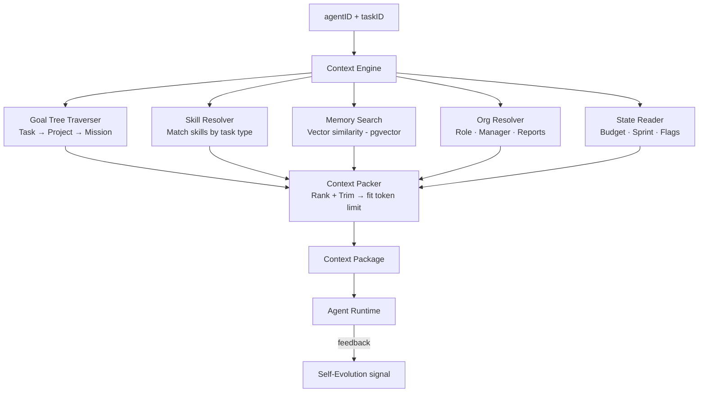

#### Context Package Structure

```text
[System layer]       Role · Skills · Behavior rules (from evolution)
[Company layer]      Mission → Project → Task (goal tree)
[Memory layer]       Top-N relevant past tickets (vector search)
[State layer]        Budget · Org position · Sprint
[Task layer]         Task detail · Dependencies · Related tasks
```

#### Context Packer Priority Rules

| Priority | Layer | Action |
|---|---|---|
| 1 — never trim | Task + Goal tree | Keep intact |
| 2 — trim if needed | Skills | Keep top 3 most relevant |
| 3 — trim more aggressively | Memory | Keep top 5 |
| 4 — summarize | Org + Budget | Compress to 1-2 lines |

---

## Go Package Structure

```text
internal/
├── company/
│   ├── domain.go
│   ├── repository.go
│   └── service.go
├── org/
│   ├── chart.go          ← hierarchy, reporting lines
│   └── goal_tree.go      ← ancestry traversal
├── agent/
│   ├── registry.go
│   ├── heartbeat.go      ← cron scheduler, goroutine per agent
│   ├── executor.go       ← atomic checkout, run, result
│   └── budget.go         ← atomic token tracking
├── skill/
│   ├── domain.go
│   ├── service.go        ← interface for legacy integrations
│   ├── evolution.go      ← proposal, diff, approve/reject
│   ├── versioning.go     ← snapshot, rollback
│   ├── security.go       ← access control, content scan
│   ├── validator.go      ← prompt injection detection
│   └── repository.go
├── context/
│   ├── engine.go         ← orchestrates the pipeline
│   ├── goal_tree.go      ← traverses ancestry
│   ├── skill_resolver.go ← matches skills to tasks
│   ├── memory.go         ← vector search (pgvector)
│   ├── org_resolver.go
│   └── packer.go         ← rank + trim → token limit
├── protocol/
│   ├── heartbeat.go      ← payload contract
│   └── response.go       ← response schema
└── audit/
    └── log.go            ← immutable event log
```

---

## Tech Stack

| Concern | Library |
|---|---|
| HTTP router | `gin-gonic/gin` |
| PostgreSQL driver | `pgx/v5` |
| Type-safe SQL | `sqlc` |
| Vector embedding | `pgvector/pgvector-go` + pgvector extension |
| Scheduler | `robfig/cron/v3` |
| Goroutine management | `golang.org/x/sync/errgroup` |
| WebSocket | `gorilla/websocket` |
| Config | `spf13/viper` |
| Logging | `go.uber.org/zap` |
| Tracing | `go.opentelemetry.io/otel` |
| Testing | `testify` |

---

## Eino Integration Strategy

Tango should treat `cloudwego/eino` as an **agent runtime framework**, not as the full orchestration backend.

### Recommended Boundary

**Tango owns the control plane:**

- Company and tenant isolation
- Agent registry
- Goal tree and task lifecycle
- Run records and retries
- Budget enforcement
- Skill assignment and approval workflows
- Audit log and policy enforcement

**Eino owns the execution plane:**

- Agent and sub-agent runtime execution
- Tool calling loops
- Supervisor, plan-execute, and deep-agent coordination
- Interrupt/resume for human-in-the-loop
- Checkpoint-aware execution state
- Runtime callbacks and streaming events

### Why This Split Works

Eino provides strong Go-native primitives for building and running agents, including multi-agent collaboration, callbacks, interrupts, resume flows, and checkpoint support. These capabilities are useful for the runtime layer inside Tango.

However, Tango still needs its own persistent orchestration model. Multi-tenant isolation, budget policy, task claiming, run history, approval gates, and auditability are product-specific concerns and should remain inside Tango's domain and application layers.

### Integration Flow

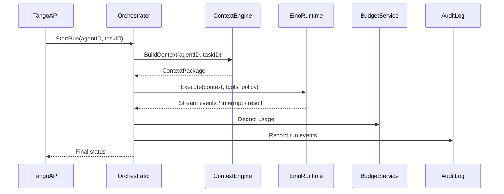

### Practical Guidance

- Use Eino runners, agent patterns, and callbacks behind an internal Tango runtime adapter.
- Do not let Eino define Tango's database schema or domain lifecycle.
- Persist Tango task, run, and budget state before and after Eino execution.
- Map Eino interrupts to Tango approval or user-input workflows.
- Treat Eino checkpoints as runtime recovery data, not as the source of truth for product state.

### Recommendation

For Tango, Eino is a good fit if the goal is to accelerate agent execution and multi-agent runtime behavior in Go. It is not a replacement for Tango's orchestration, policy, and persistence layers.

---

## Implementation Roadmap

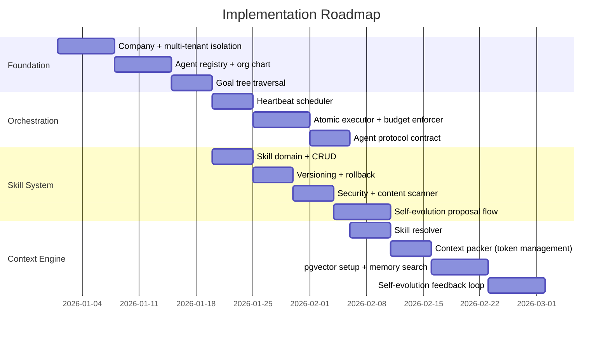

### Priority Order

| Phase | Module | Reason |
|---|---|---|
| 1 | Company + Agent Registry | Foundational, everything depends on it |
| 2 | Goal Tree + Org Chart | Required early by the context engine |
| 3 | Heartbeat + Executor + Budget | Core runtime behavior |
| 4 | Skill CRUD + Versioning | Needed before security hardening |
| 5 | Context Engine (packer + skill resolver) | Connects the system together |
| 6 | pgvector + Memory Search | More useful once real data exists |
| 7 | Security + Content Scanner | Hardening and review |
| 8 | Self-Evolution | Best added after production data exists |

---

## Important Design Notes

**Cross-company isolation:** never trust only the application layer. Every relevant query should include `WHERE company_id = $1`. PostgreSQL RLS should act as a second layer of defense.

**Atomic operations:** task checkout and budget deduction must happen inside database transactions. Do not rely on Redis locks or application-level mutexes.

**Skill injection timing:** only inject skills relevant to the current task, never the full skill set. Use tag matching first and semantic similarity second.

**Memory search:** implement this later, once real data exists. Empty embeddings provide little value.

**Self-evolution:** the agent may propose, but the user decides. Never auto-apply proposals. `actor_id` in the audit log should be the `agent_id` so every change remains traceable.
