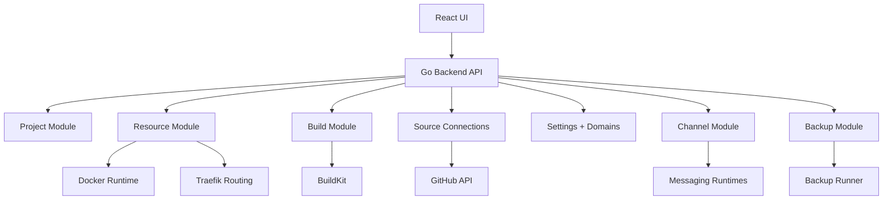
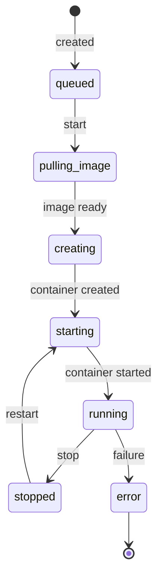
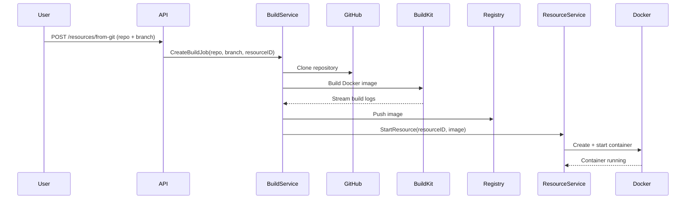
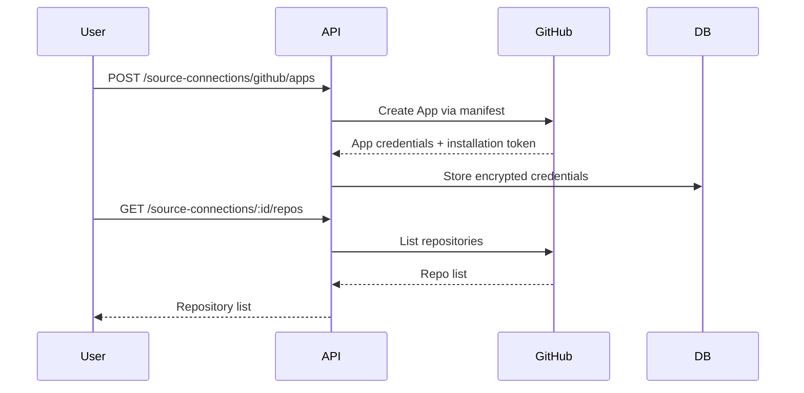
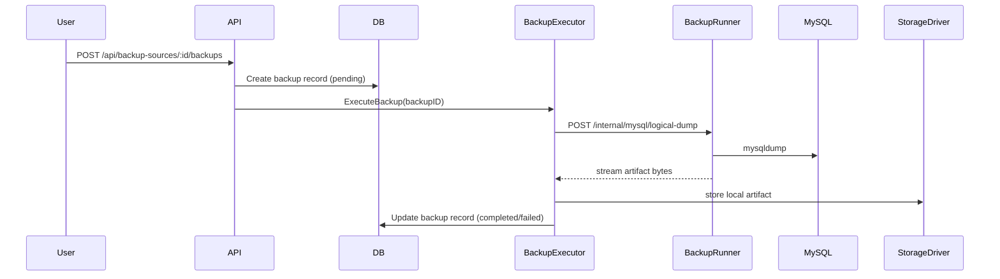
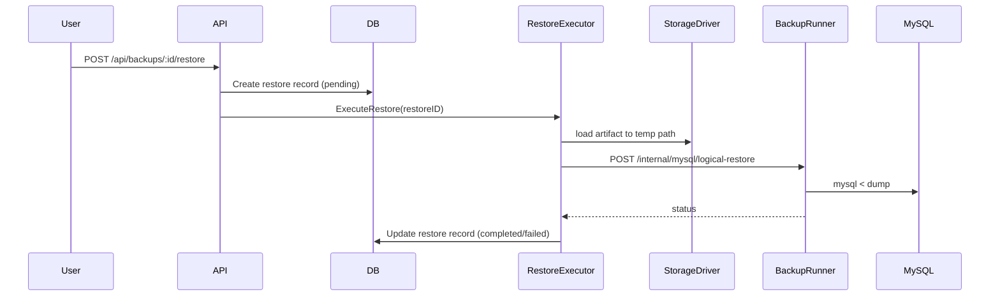
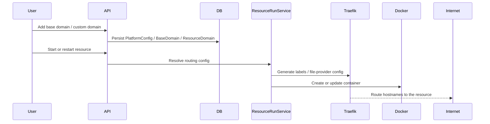
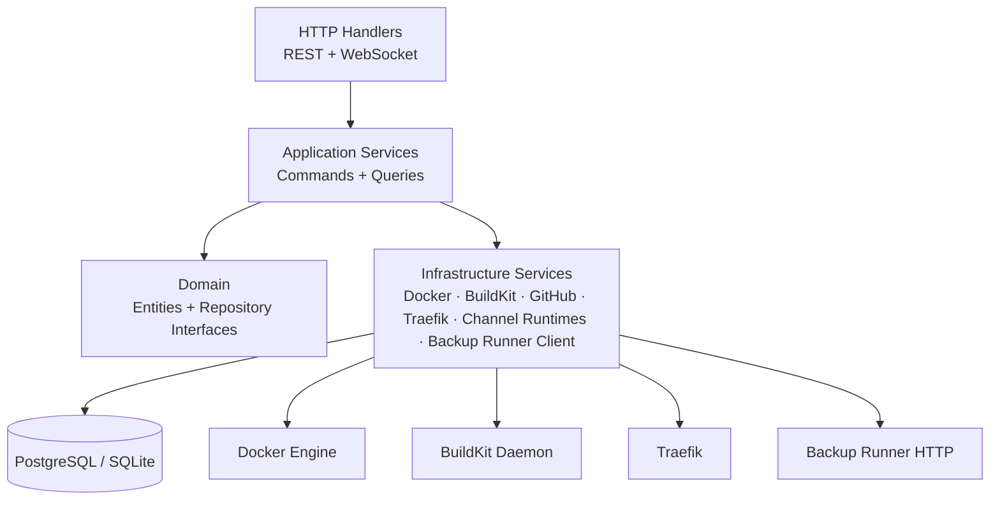
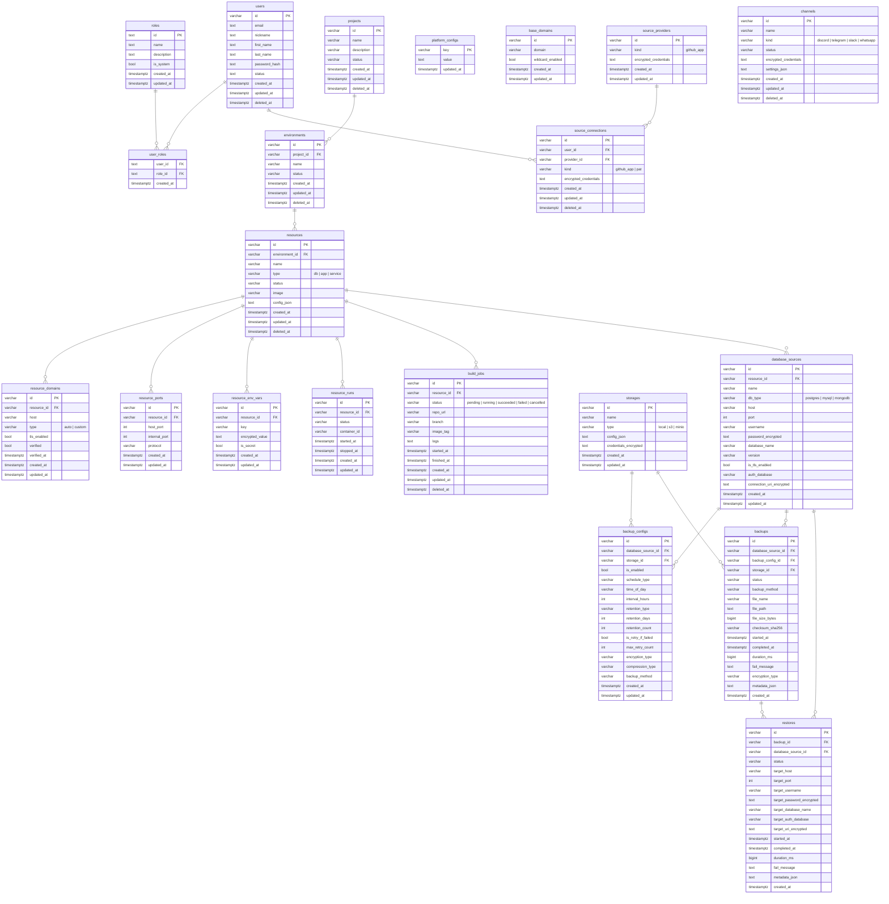

# Tango Cloud — Architecture & Implementation Plan

> This document captures the system design, module breakdown, and domain model for the Tango Cloud backend.

---

## System Overview

Tango Cloud is a self-hosted platform for managing containerized workloads. Users organize their work into **Projects → Environments → Resources**, build Docker images from git repositories via BuildKit, publish services behind managed domains, manage external integrations through **Channels**, and execute database backup/restore workflows through a dedicated internal runner service.



---

## Core Domain Model

### Hierarchy

```
Project
└── Environment (fork-able)
    └── Resource (db | app | service)
        ├── ResourcePort
        ├── ResourceEnvVar
        ├── ResourceDomain
        └── ResourceRun

PlatformConfig
└── BaseDomain

DatabaseSource
├── BackupConfig
├── Backup
└── Restore

Storage
└── BackupConfig
```

### Resource Types

| Type      | Description                                                   |
| --------- | ------------------------------------------------------------- |
| `db`      | Database containers (Postgres, MySQL, Redis, MongoDB, etc.)   |
| `app`     | Application containers; can be built from a git repository    |
| `service` | Supporting service containers                                 |

### Resource Lifecycle



### Domain Routing Model

Resources that expose HTTP traffic can be routed through Traefik using two domain categories:

| Type | Description |
| ---- | ----------- |
| `auto` | Generated from a managed base domain, optionally using wildcard DNS |
| `custom` | User-supplied hostname that must be DNS-verified before secure routing |

Platform settings control:

- public IP used for verification guidance
- app domain and app TLS exposure
- Traefik Docker network
- certificate resolver
- managed base domains and whether wildcard routing is enabled on each

---

## Build Pipeline

The build pipeline allows `app` resources to be built from source code.



### Build Job Lifecycle

```
pending → running → succeeded
                 → failed
                 → cancelled
```

Real-time build logs are streamed to the browser via WebSocket at `/api/ws/builds/:id`.

---

## Source Connections

Source connections store credentials for accessing private git repositories.

### Connection Types

| Type         | Description                                      |
| ------------ | ------------------------------------------------ |
| `github_app` | GitHub OAuth App (manifest flow, broader scope)  |
| `pat`        | Personal Access Token (simpler, user-scoped)     |

Credentials (tokens, keys) are AES-encrypted before being stored in the database.

### GitHub Integration Flow



---

## Channel Module

Channels connect external messaging platforms to the platform for notification and interaction.

### Supported Channels

| Kind       | Description                             |
| ---------- | --------------------------------------- |
| `discord`  | Discord bot integration                 |
| `telegram` | Telegram bot integration                |
| `slack`    | Slack workspace integration             |
| `whatsapp` | WhatsApp (QR code provisioning)         |

Channel credentials are encrypted at rest. Each channel runs an independent runtime goroutine started/stopped via the channel service.

---

## Backup Module

### Responsibilities

- manage `database_sources`, `storages`, `backup_configs`, `backups`, `restores`
- keep credentials encrypted at rest
- orchestrate backup/restore status in the main API database
- call a dedicated runner service for MySQL logical dump and restore execution
- support local storage first, while keeping the storage abstraction open for S3/MinIO later

### Current Scope

- MySQL only
- logical dump / restore only
- local storage only
- gzip compression
- UI integrated in the resource Backups tab

### Execution Flow





### Backup Runner

`backup-runner` is a second binary inside the same monorepo:

- entrypoint: [main.go](/Users/felix/project-repos/tango-cloud/cmd/backup-runner/main.go)
- HTTP layer: [router.go](/Users/felix/project-repos/tango-cloud/internal/runner/http/router.go)
- MySQL execution: [mysql_runner.go](/Users/felix/project-repos/tango-cloud/internal/runner/service/mysql_runner.go)

It is intentionally:
- stateless
- internal-only
- Linux-focused
- responsible for carrying versioned MySQL CLI binaries in its own image

### Tooling Layout

Bundled MySQL client binaries live in [assets/tools](/Users/felix/project-repos/tango-cloud/assets/tools). The runner image copies the correct arch bundle into `/usr/local/mysql-<version>/bin` and resolves:

- `/usr/local/mysql-8.0/bin/mysqldump`
- `/usr/local/mysql-8.4/bin/mysqldump`
- `/usr/local/mysql-9/bin/mysqldump`
- and the matching `mysql` restore binaries

### Deployment Shape

The system now supports two container images:

1. `tango-cloud`
- API + embedded frontend

2. `tango-backup-runner`
- internal dump/restore execution service

For deploy/VPS:
- `docker-compose.yml` uses `image:` for both services
- app talks to runner at `http://backup-runner:8081`

For local development:
- `docker-compose.dev.yml` overrides the runner to `build:` from source
- local API talks to runner at `http://127.0.0.1:8081`

---

## Routing & DNS Module

The routing subsystem bridges resources to external hostnames through Traefik.

### Responsibilities

- persist platform-wide routing settings
- manage reusable base domains
- attach custom or auto-generated domains to resources
- verify custom-domain DNS resolution against the server public IP
- generate Docker labels and Traefik dynamic config for HTTP/HTTPS routing

### Routing Flow



### Routing Rules

- auto domains can be generated from managed base domains
- custom domains can enable HTTP or HTTPS per domain entry
- verified custom domains are eligible for TLS/cert resolver routing
- base-domain availability is checked before assignment to avoid hostname collisions

---

## Module Architecture

### Five Main Layers



---

## Domain ERD



---

## Go Package Structure

```text
internal/
├── domain/
│   ├── project.go
│   ├── environment.go
│   ├── resource.go
│   ├── resource_port.go
│   ├── resource_env_var.go
│   ├── resource_run.go
│   ├── database_source.go
│   ├── storage.go
│   ├── backup_config.go
│   ├── backup.go
│   ├── restore.go
│   ├── build_job.go
│   ├── source_connection.go
│   ├── source_provider.go
│   └── channel.go
├── application/
│   ├── command/        ← write use cases
│   ├── query/          ← read use cases
│   └── services/       ← service contracts
├── runner/
│   ├── http/           ← internal runner HTTP endpoints
│   ├── model/          ← runner request / response types
│   ├── service/        ← CLI execution services
│   └── tools/          ← runner-side tool resolution
├── infrastructure/
│   ├── persistence/
│   │   ├── models/     ← GORM records
│   │   └── repositories/
│   └── services/
│       ├── build_service.go       ← BuildKit + git clone
│       ├── docker_service.go      ← Docker Engine runtime
│       ├── github_service.go      ← GitHub API integration
│       ├── backup_runner_client.go← API -> backup-runner bridge
│       └── channel_runtimes/      ← Discord, Telegram, Slack, WhatsApp
└── handler/
    ├── rest/           ← HTTP handlers
    └── ws/             ← WebSocket handlers (logs, terminal)
```

---

## Tech Stack

| Concern           | Library / Tool                         |
| ----------------- | -------------------------------------- |
| HTTP router       | `gin-gonic/gin`                        |
| ORM               | `gorm.io/gorm`                         |
| Database          | PostgreSQL (prod) / SQLite (local)     |
| Container runtime | Docker Engine API (`docker/docker`)    |
| Image builds      | BuildKit (`moby/buildkit`)             |
| WebSocket         | `gorilla/websocket`                    |
| Config            | environment variables + `viper`        |
| Auth              | JWT (`golang-jwt/jwt`) + bcrypt        |
| Encryption        | AES-256 for secrets at rest            |
| DB backup runner  | internal HTTP service + MySQL CLI      |
| Frontend          | Vite + React + TanStack Router         |
| Styling           | Tailwind CSS v4                        |

---

## Implementation Roadmap

### Phase 1 — Core Platform (done)

- [x] Auth (JWT + bcrypt)
- [x] Project / Environment / Resource CRUD
- [x] Resource lifecycle (start / stop / logs)
- [x] Port conflict detection
- [x] Environment variables with encryption
- [x] Docker runtime integration

### Phase 2 — Build Pipeline (done)

- [x] BuildKit integration
- [x] Git-based resource creation
- [x] Build job lifecycle management
- [x] Real-time build log streaming (WebSocket)
- [x] GitHub source connections (OAuth App + PAT)
- [x] Branch listing and repo browser

### Phase 3 — Developer Experience (in progress)

- [ ] Environment fork with resource cloning
- [ ] Resource templates (one-click Postgres, Redis, etc.)
- [ ] Container terminal improvements (resize, history)
- [ ] Resource health checks and auto-restart
- [ ] Deployment history and rollback
- [x] MySQL logical backup / restore with runner-based execution

### Phase 4 — Collaboration & Ops

- [ ] Multi-user project access control
- [ ] Resource metrics (CPU, memory, network)
- [ ] Scheduled resource start/stop
- [ ] Webhook notifications on build/deploy events
- [ ] Audit log for resource and build actions

---

## Important Design Notes

**Encrypted secrets:** environment variables marked `is_secret=true` and all channel/source credentials are AES-encrypted before DB storage. The encryption key (`LLM_CONFIG_ENCRYPTION_KEY`) must be exactly 32 characters.

**Docker isolation:** each resource maps to a single Docker container. Port conflicts are validated before start — no two resources in the same environment may expose the same host port.

**BuildKit requirement:** the build pipeline requires a running BuildKit daemon. Without `BUILDKIT_HOST`, git-based builds will fail. The Docker-in-Docker setup in `docker-compose.yml` provisions this automatically.

**Backup runner requirement:** MySQL backup and restore require a reachable `backup-runner` service. In local development, the API can call `http://127.0.0.1:8081`; in compose/VPS deployments, it should use `http://backup-runner:8081`.

**Bundled DB tools:** the backup runner image carries versioned MySQL client tools. The main API process no longer assumes local access to `mysqldump` or `mysql`.

**WebSocket streams:** build logs and resource run logs are streamed over persistent WebSocket connections. The browser reconnects automatically on disconnect.

**Schema changes:** simple additions (new nullable columns) can rely on `AutoMigrate()`. Destructive changes (renames, drops, type changes) require manual migration scripts.
